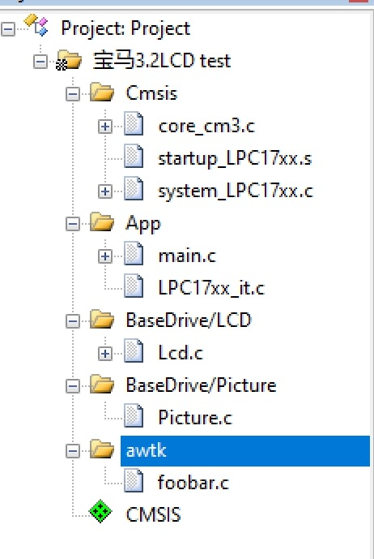

# NXP LPC1768 移植笔记

## 1. 介绍

[LPC1768](https://baike.baidu.com/item/LPC1768) 具有 512KB 的 flash 存储器、64KB 的数据存储器，这是 AWTK 能运行的最低配置。对于更低的配置，则需要做些定制裁剪，裁剪过程很复杂，需要专业人士来做，本文这里就不多说。

LPC1768 和 STM32F103 是一个等级的芯片，移植的方法基本一样，STM32F103 及同类芯片的移植均可参考本文。

本文以 [旺宝开发板宝马 NXP LPC1768+3.2 寸液晶屏 学习板单片机 ](https://item.taobao.com/item.htm?spm=a1z10.5-c-s.w4002-2057489827.21.383e6070DO0RFI&id=41360412223) 载体移植，其它板子其根据实际情况进行调整。

在移植的时候，不管是什么板子，拿到板子的资料后，先找一个带有显示功能的最简示例。以这个最简示例为模板，加入 AWTK 相关代码再进行移植。本文中使用开发板提供的显示图片的例子，具体位置在：

```
旺宝 LPC1768 开发板、3. 源代码-Example\2、TFT 屏例程、3.2 寸、【1】旺宝 1768_LCD 显示图片、【01】宝马 1768_LCD 显示 dada
```

> 这是一个 Keil 工程，在移植之前，先确保该工程，能够正常运行和显示图形。

## 2. 将 awtk 项目取到当前目录

* 从 github 上获取源码

```
git clone https://github.com/zlgopen/awtk.git
```

* 确保 awtk 是在当前目录中。

```
drwxr-xr-x 1 Admin 197121     0 4 月  29 21:53 App/
drwxr-xr-x 1 Admin 197121     0 4 月  30 07:00 awtk/
drwxr-xr-x 1 Admin 197121     0 4 月  30 07:01 awtk-port/
drwxr-xr-x 1 Admin 197121     0 4 月  29 21:53 BaseDrive/
```

## 3. 在当前目前创建 awtk-port 子目录

```
drwxr-xr-x 1 Admin 197121     0 4 月  29 21:53 App/
drwxr-xr-x 1 Admin 197121     0 4 月  30 07:00 awtk/
drwxr-xr-x 1 Admin 197121     0 4 月  30 07:01 awtk-port/
drwxr-xr-x 1 Admin 197121     0 4 月  29 21:53 BaseDrive/
```

## 4. 创建配置文件 awtk-port/awtk_config.h 

```
-rw-r--r-- 1 Admin 197121 3930 4 月  30 07:13 awtk-port/awtk_config.h
```

在创建配置文件时，以以下文件为蓝本，并参考类似平台的配置：

```
awtk/src/base/awtk_config_sample.h
```

对于低端平台 (Cortex M3)，典型的配置如下：

```
/**
 * 嵌入式系统有自己的 main 函数时，请定义本宏。
 *
 */
 #define USE_GUI_MAIN 1

/**
 * 如果需要支持预先解码的位图字体，请定义本宏。一般只在 RAM 极小时，才启用本宏。
 */
#define WITH_BITMAP_FONT 1

/**
 * 如果定义本宏，使用标准的 UNICODE 换行算法，除非资源极为有限，请定义本宏。
 *
 */
#define WITH_UNICODE_BREAK 1

/**
 * 如果不需输入法，请定义本宏
 *
 */
#define WITH_NULL_IM 1

/**
 * 如果出现 wcsxxx 之类的函数没有定义时，请定义该宏
 *
 * #define WITH_WCSXXX 1
 */
#define WITH_WCSXXX 1

/**
 * 对于低端平台，如果不使用控件动画，请定义本宏。
 *
 */
 #define WITHOUT_WIDGET_ANIMATORS 1

/**
 * 对于低端平台，如果不使用窗口动画，请定义本宏。
 *
 */
 #define WITHOUT_WINDOW_ANIMATORS 1

/**
 * 对于低端平台，如果不使用对话框高亮策略，请定义本宏。
 *
 */
 #define WITHOUT_DIALOG_HIGHLIGHTER 1

/**
 * 对于低端平台，如果不使用扩展控件，请定义本宏。
 *
 */
 #define WITHOUT_EXT_WIDGETS 1

/**
 * 对于低端平台，如果内存不足以提供完整的 FrameBuffer，请定义本宏启用局部 FrameBuffer，可大幅度提高渲染性能。
 *
 */
#define FRAGMENT_FRAME_BUFFER_SIZE 8 * 1024
```

## 5. 加入 AWTK 的源文件

AWTK 的源文件很多，而且不同的平台，加入的文件有所不同，导致加文件的过程非常痛苦。为此，我把 cortex m3 需要的文件，放到 files/files_m3.txt 文件中，并本生成 keil 需要的 xml 格式，放到 files/files_m3.xml 中。自己创建项目时，把 files/files_m3.xml 中的内容放到 Project/Project.uvprojx 即可。

如果不知放到 Project/Project.uvprojx 中哪个位置，我们可以先在 keil 中创建一个 Group，名为 awtk，并添加一个 foobar.c 的文件：



保存并关闭项目，用 notepad++等编辑器打开 Project/Project.uvprojx，找到 foobar.c 的位置：


用 files/files_m3.xml 中的内容替换选中部分的内容，保存文件。

> 如果 Project.uvprojx 文件不是在 Project（或其它名字）子目录下，而是项目根目录下（和 awtk 并列），则需要编辑 files/files_m3.xml，把。.\awtk 替换成。\awtk。

用keil重新打开工程文件Project.uvprojx，我们可以看到文件已经加入：

